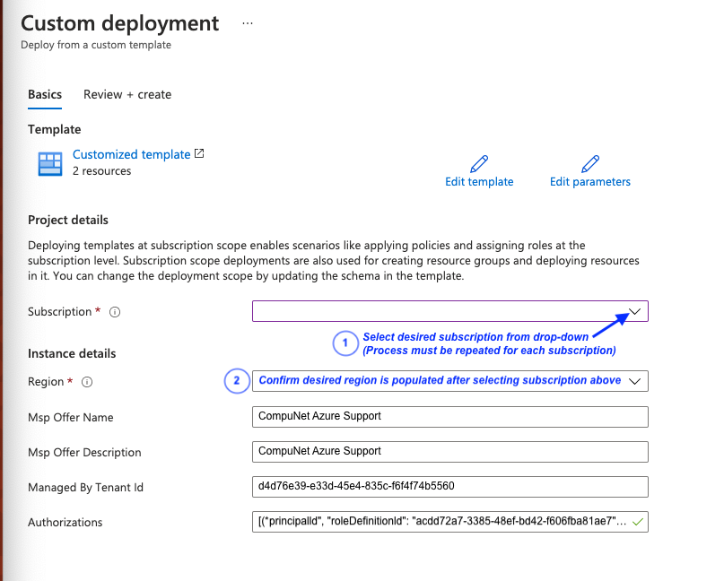

# Click this button to deploy Lighthouse template

## Description
Azure Lighthouse provides CompuNet delegated access to subscriptions in your Azure environment, facilitating project work and ongoing support—all while leaving your organization in control. Lighthouse eliminates the need to create administrator accounts for CompuNet engineers in your organization's Azure AD tenant and establishes a secure partner relationship, providing greater visibility of CompuNet's access and actions.

CompuNet strives to reduce risk through the principles of "just enough" and "just in time" access. CompuNet leverages Azure AD Privileged Identity Management to grant our engineers the minimum level of permissions required to support your environment and provide a secure method of temporarily elevating access when necessary.

Below you will find instructions for deploying Azure Lighthouse (it's simple!) as well as a list of authorizations, or role-based access control assignments that will be provided to CompuNet. As always, please reach out to us if you have any questions!

## Deployment Instructions
1. Click the _**Deploy to Azure**_ button above

2. Be sure to be signed in with an Azure AD account that has _Microsoft.Authorization/roleAssignments/write_ permissions (typically a user assigned to Owner role for the Azure subscription)

3. On the "Custom Deployment" page, select the appropriate subscription from the dropdown and then verify that the correct Region is populated

4. Click _**Review + Create**_ at the bottom of the screen

5. After automatic deployment validation is complete, click _**Create**_

## Parameters
**mspOfferName**: CompuNet Azure Support

**mspOfferDescription**: CompuNet Azure Support <description>

**managedByTenantId**: d4d76e39-e33d-45e4-835c-f6f4f74b5560

## Authorizations
CompuNet Authorization Display Name | Azure Built-in RBAC Role | RBAC Role ID
--- | --- | ---
CompuNet Read-Only Support | [Reader] | `acdd72a7-3385-48ef-bd42-f606fba81ae7`
CompuNet Backup Support | [Backup Operator] | `00c29273-979b-4161-815c-10b084fb9324`
CompuNet Operations Readers | [Log Analytics Reader] | `73c42c96-874c-492b-b04d-ab87d138a893`
CompuNet Operations Readers | [Azure Sentinel Reader] | `8d289c81-5878-46d4-8554-54e1e3d8b5cb`
CompuNet Backup Operations | [Backup Operator] | `00c29273-979b-4161-815c-10b084fb9324`
CompuNet Automation Operations | [Automation Operator] | `d3881f73-407a-4167-8283-e981cbba0404`
CompuNet Cost Management | [Cost Management Contributor] | `434105ed-43f6-45c7-a02f-909b2ba83430`
CompuNet Tag Operations | [Tag Contributor] | `4a9ae827-6dc8-4573-8ac7-8239d42aa03f`
CompuNet Kubernetes Operations | [AKS Cluster User] | `4abbcc35-e782-43d8-92c5-2d3f1bd2253f`
CompuNet Policy Management | [Resource Policy Contributor] | `36243c78-bf99-498c-9df9-86d9f8d28608`
CompuNet Policy Remediation Management | [User Access Administrator]* | `18d7d88d-d35e-4fb5-a5c3-7773c20a72d9`
CompuNet Billing Integration | [Billing Reader] | `fa23ad8b-c56e-40d8-ac0c-ce449e1d2c64`

*_CompuNet Policy Remediation Management, delegated the **User Access Administrator** role, is limited to assigning managed identities the following RBAC roles ([Learn more][1])_:

Assignable Role | RBAC Role ID
--- | ---
[Log Analytics Contributor] | `92aaf0da-9dab-42b6-94a3-d43ce8d16293`
[Virtual Machine Contributor] | `9980e02c-c2be-4d73-94e8-173b1dc7cf3c`
[Backup Contributor] | `5e467623-bb1f-42f4-a55d-6e525e11384b`
[Monitoring Contributor] | `749f88d5-cbae-40b8-bcfc-e573ddc772fa`
[Security Admin] | `fb1c8493-542b-48eb-b624-b4c8fea62acd`
[Contributor] | `b24988ac-6180-42a0-ab88-20f7382dd24c`

## Eligible Authorizations
Authorization Display Name | Azure Built-in RBAC Role | RBAC Role ID | Max Activation Time | Approval Required?
--- | --- | --- | --- | ---
CompuNet Elevated Operations | [Contributor] | `b24988ac-6180-42a0-ab88-20f7382dd24c` | 8 hours | False
CompuNet Kubernetes Management | [AKS Cluster Admin] | `0ab0b1a8-8aac-4efd-b8c2-3ee1fb270be8` | 4 hours | False
CompuNet Elevated Management | [Contributor] | `b24988ac-6180-42a0-ab88-20f7382dd24c` | 30 minutes | False
CompuNet Blueprint Management | [Blueprint Contributor] | `41077137-e803-4205-871c-5a86e6a753b4` | 30 minutes | True
CompuNet Blueprint Assignements | [Blueprint Operator] | `437d2ced-4a38-4302-8479-ed2bcb43d090` | 30 minutes | True

<!-- Hyperlinks -->
[Reader]: https://docs.microsoft.com/en-us/azure/role-based-access-control/built-in-roles#reader
[Backup Operator]: https://docs.microsoft.com/en-us/azure/role-based-access-control/built-in-roles#backup-operator
[Log Analytics Reader]: https://docs.microsoft.com/en-us/azure/role-based-access-control/built-in-roles#log-analytics-reader
[Azure Sentinel Reader]: https://docs.microsoft.com/en-us/azure/role-based-access-control/built-in-roles#azure-sentinel-reader
[Automation Operator]: https://docs.microsoft.com/en-us/azure/role-based-access-control/built-in-roles#automation-operator
[Cost Management Contributor]: https://docs.microsoft.com/en-us/azure/role-based-access-control/built-in-roles#cost-management-contributor
[Tag Contributor]: https://docs.microsoft.com/en-us/azure/role-based-access-control/built-in-roles#tag-contributor
[AKS Cluster User]: https://docs.microsoft.com/en-us/azure/role-based-access-control/built-in-roles#azure-kubernetes-service-cluster-user-role
[AKS Cluster Admin]: https://docs.microsoft.com/en-us/azure/role-based-access-control/built-in-roles#azure-kubernetes-service-cluster-admin-role
[Contributor]: https://docs.microsoft.com/en-us/azure/role-based-access-control/built-in-roles#contributor
[Resource Policy Contributor]: https://docs.microsoft.com/en-us/azure/role-based-access-control/built-in-roles#resource-policy-contributor
[User Access Administrator]: https://docs.microsoft.com/en-us/azure/role-based-access-control/built-in-roles#user-access-administrator
[Blueprint Contributor]: https://docs.microsoft.com/en-us/azure/role-based-access-control/built-in-roles#blueprint-contributor
[Blueprint Operator]: https://docs.microsoft.com/en-us/azure/role-based-access-control/built-in-roles#blueprint-operator
[Log Analytics Contributor]: https://docs.microsoft.com/en-us/azure/role-based-access-control/built-in-roles#log-analytics-contributor
[Virtual Machine Contributor]: https://docs.microsoft.com/en-us/azure/role-based-access-control/built-in-roles#virtual-machine-contributor
[Backup Contributor]: https://docs.microsoft.com/en-us/azure/role-based-access-control/built-in-roles#backup-contributor
[Monitoring Contributor]: https://docs.microsoft.com/en-us/azure/role-based-access-control/built-in-roles#monitoring-contributor
[Security Admin]: https://docs.microsoft.com/en-us/azure/role-based-access-control/built-in-roles#security-admin
[Billing Reader]: https://docs.microsoft.com/en-us/azure/role-based-access-control/built-in-roles#billing-reader

[1]: https://docs.microsoft.com/en-us/azure/lighthouse/how-to/deploy-policy-remediation#create-a-user-who-can-assign-roles-to-a-managed-identity-in-the-customer-tenant
